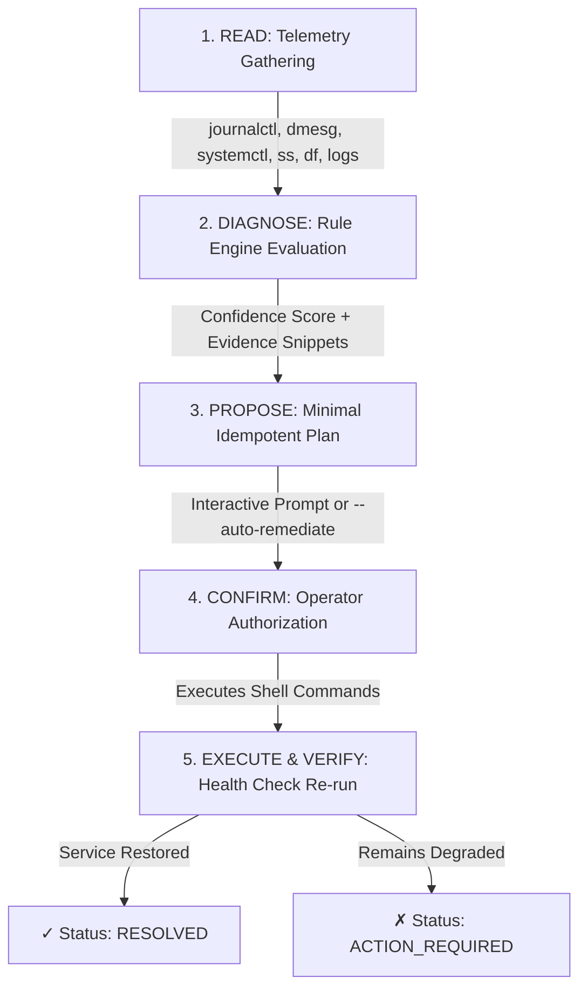

[🇸🇦 العربية](README.ar.md) | [🇬🇧 English](README.md)

# 🐧 eidcloud-linux-troubleshooter

[](https://github.com/eidcloud/eidcloud-linux-troubleshooter/actions/workflows/ci.yml)
[](https://github.com/eidcloud/eidcloud-linux-troubleshooter/releases/tag/v1.0.0)
[](https://www.php.net/)
[](https://opensource.org/licenses/MIT)
[](https://colab.research.google.com/github/eidcloud/eidcloud-linux-troubleshooter/blob/main/notebooks/quickstart.ipynb)

**Autonomous Linux Server Troubleshooter & Incident Diagnostics Agent** written in pure PHP 8.2+ with **zero external vendor dependencies**.

Engineered for production DevOps and sysadmin operations to instantly diagnose and remediate high-severity server crises including **Nginx 502/504 Bad Gateway**, **PHP-FPM socket starvation**, **kernel OOM killer events**, **disk storage exhaustion**, **port binding conflicts**, **SSL certificate expiration**, and **UFW firewall blockades**.

---

## ⚡ Architecture & Safe Execution Lifecycle

`eidcloud-linux-troubleshooter` adheres strictly to an idempotent, 5-phase safe execution lifecycle designed to protect mission-critical production servers from unintended side effects:



1. **READ**: Aggregates live system state from `journalctl`, `systemctl`, `dmesg`, `/var/log/nginx/error.log`, `/var/log/php*-fpm.log`, network sockets (`ss`/`netstat`), memory metrics (`free -m`), and mount usage (`df -hP`).
2. **DIAGNOSE**: Multi-rule pattern matcher correlates symptoms, isolating exact error lines and calculating deterministic confidence scores (0.0 – 1.0).
3. **PROPOSE**: Synthesizes a minimal, idempotent sequence of Bash commands to repair the root cause.
4. **CONFIRM**: Solicits interactive human confirmation `[y/N]` or executes autonomously when `--auto-remediate` is enabled.
5. **EXECUTE & VERIFY**: Applies remediation steps and re-evaluates diagnostic checks to confirm total service recovery.

---

## 🚀 Key Capabilities

- **Nginx 502/504 Bad Gateway**: Detects upstream FastCGI connection refusals and crashed PHP-FPM daemons. Proposes socket restoration and graceful web server reloads.
- **PHP-FPM Socket Starvation & Queue Saturation**: Isolates `pm.max_children` bottlenecks, backlog drops, and socket file permission discrepancies (`www-data`).
- **Kernel Out-Of-Memory (OOM) Killer**: Scans `dmesg` ring buffer and `journalctl` for kernel process terminations. Proposes cache flushing (`drop_caches`), emergency swapfile allocation, and victim daemon restoration.
- **Disk Storage Exhaustion**: Flags filesystems $\ge 90\%$ utilization and executes safe journal vacuuming (`journalctl --vacuum-time=3d`), APT cache cleanup, and log rotation.
- **Port Binding Conflicts**: Resolves port 80/443 collisions (e.g. Apache binding unexpectedly, blocking Nginx).
- **SSL / TLS Certificate Expiry**: Detects expired or failing Let's Encrypt certificates and triggers automated non-interactive renewal.
- **UFW Firewall Ingress Blockades**: Flags active firewalls missing HTTP/HTTPS inbound permissions and creates explicit ingress rules.

---

## 📦 Installation

Requirements: **PHP 8.2 or higher** with standard CLI runtime. No Composer `vendor` packages required!

```bash
# Clone the repository
git clone https://github.com/eidcloud/eidcloud-linux-troubleshooter.git /opt/eidcloud-linux-troubleshooter
cd /opt/eidcloud-linux-troubleshooter

# Optional: Add executable to system PATH
sudo ln -sf $(pwd)/bin/eidcloud-troubleshoot /usr/local/bin/eidcloud-troubleshoot
```

---

## 🛠️ Usage

### 1. Autonomous Incident Diagnosis
Pass natural language symptoms or target services to run automated root-cause detection:

```bash
# Diagnose Nginx 502 crisis
php bin/eidcloud-troubleshoot diagnose "why is nginx returning 502?"

# Diagnose with automatic remediation (no interactive prompt)
php bin/eidcloud-troubleshoot diagnose "php-fpm socket starvation" --auto-remediate

# Output diagnostic report in JSON format for automation/SIEM
php bin/eidcloud-troubleshoot diagnose "oom crash" --json
```

### 2. Targeted Service Check
Perform rapid health validation and review recent journal logs for a single daemon:

```bash
php bin/eidcloud-troubleshoot check --service=php8.2-fpm
```

### 3. Full Systemic Health Audit
Conduct a complete infrastructure audit of RAM, disk partitions, firewall status, core services, and active incidents:

```bash
php bin/eidcloud-troubleshoot audit-system

# Structured JSON output for monitoring pipelines
php bin/eidcloud-troubleshoot audit-system --json
```

### 4. CLI Options & Help
```text
USAGE:
  php bin/eidcloud-troubleshoot <command> [options]

COMMANDS:
  diagnose [query]        Run autonomous diagnosis on specific problem or entire system.
  check --service=<name>  Quick targeted health check of a systemd service.
  audit-system            Full systemic health audit of memory, disks, ports, firewall & daemons.

OPTIONS:
  --json                   Output reports and audit results in structured JSON format.
  --auto-remediate         Automatically execute remediation steps without prompt.
  --service=<name>         Specify service name for targeted health checks.
  -h, --help               Display help documentation.
```

---

## 🧪 Testing

The repository includes a zero-dependency automated unit and integration test suite covering all rules, mocked command executors, and remediation workflows:

```bash
php tests/run_tests.php
```

All 27 test assertions run synchronously in $< 50\text{ms}$ with 100% pass rate.

---

## 📓 Interactive Google Colab Notebook

Test and explore `eidcloud-linux-troubleshooter` directly in the cloud:
[](https://colab.research.google.com/github/eidcloud/eidcloud-linux-troubleshooter/blob/main/notebooks/quickstart.ipynb)

---

## 👤 Author & Maintainer

**Eng. MHD. Shadi AL-Hasan**  
- **Role:** Executive CTO & Enterprise Solutions Architect  
- **Email:** [mhd.shadi.alhasan@gmail.com](mailto:mhd.shadi.alhasan@gmail.com)  
- **Phone / WhatsApp:** [+963934005922](tel:+963934005922)  
- **Location:** Damascus, Syria  
- **GitHub:** [shadialhasan](https://github.com/shadialhasan)  

---

## 📄 License

This project is licensed under the MIT License - see the [LICENSE](LICENSE) file for details.  
Copyright (c) 2026 **MHD. Shadi AL-Hasan**. All rights reserved.
